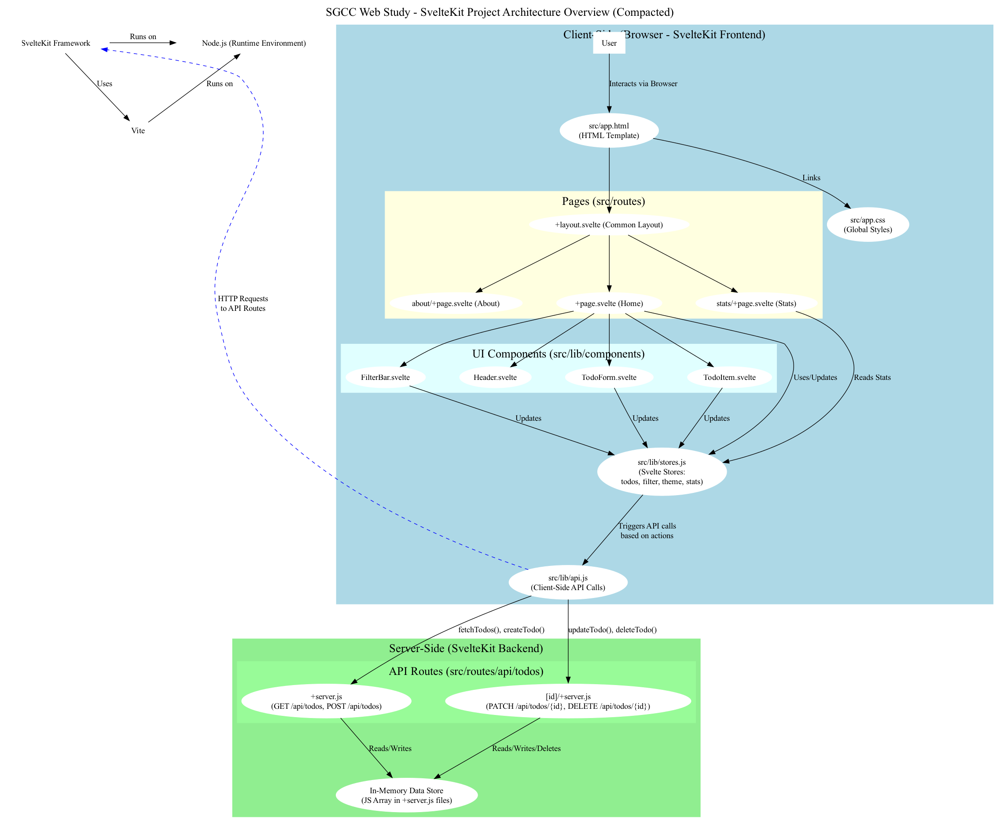

# SGCC Web Study - Svelte & SvelteKit 샘플 프로젝트 분석하기

## 실행 방법

```bash
git clone https://github.com/revenantonthemission/sgcc-web-study.git
cd sgcc-web-study
git checkout svelte-sveltekit-tutorial
npm run dev
```

```bash
    VITE v6.3.5  ready in 343 ms

  ➜  Local:   http://localhost:5173/
  ➜  Network: use --host to expose
  ➜  press h + enter to show help
```

## 스크린샷


## 프로젝트 구조



## 파일 구조

```txt
src/
├── app.html              # HTML 템플릿
├── app.css              # 전역 스타일
├── lib/
│   ├── stores.js        # Svelte 스토어
│   ├── api.js          # API 호출 함수
│   └── components/      # 재사용 핵심 컴포넌트
│       ├── Header.svelte
│       ├── TodoForm.svelte
│       ├── TodoItem.svelte
│       └── FilterBar.svelte
└── routes/
    ├── +layout.svelte   # 공통 레이아웃
    ├── +page.svelte     # 홈 페이지
    ├── +error.svelte    # 에러 페이지
    ├── stats/
    │   └── +page.svelte # 통계 페이지
    ├── about/
    │   └── +page.svelte # 정보 페이지
    └── api/
        └── todos/       # API 라우트

```
